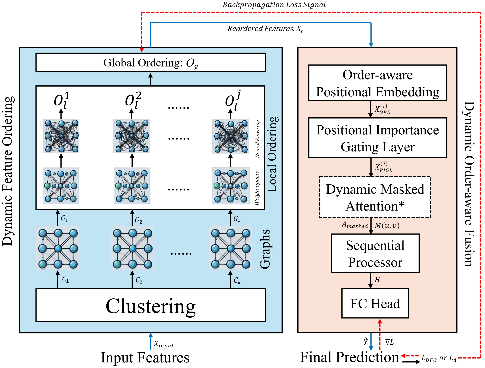

# DynaTab: Dynamic Feature Ordering as Neural Rewiring for High-Dimensional Tabular Data


[](https://neuroai-multimodal-workshop.github.io/)


<p align="center">
  
</p>

DynaTab is a neuro-inspired tabular deep learning model for high-dimensional tabular data that tackles the Column Permutation Problem by dynamically reordering features instead of treating them as a fixed set. It predicts when feature ordering is beneficial using an intrinsic-dimensionality-based IDF/FOE criterion, then applies dynamic feature ordering (DFO) to rewire feature graphs and produce a task-aware global sequence. This reordered input is processed by an order-aware fusion block combining positional embeddings (OPE), importance gating (PIGL), and dynamic masked attention (DMA) on top of a sequential backbone (Transformer, DAE, LSTM, Mamba, or DAE-MHA-LSTM). It also empirically group tabular datasets into 5 categories. Across 36 real-world datasets and over 45 baselines, DynaTab achieves strong, statistically significant gains, particularly in high-dimensional low-sample-size (HDLSS) and other complex regimes, positioning dynamic feature ordering as a powerful paradigm for order-sensitive backbones in tabular deep learning for high-dimensional tabular data.

## Citation

Al Zadid Sultan Bin Habib, Gianfranco Doretto, and Donald A. Adjeroh.  
“DynaTab: Dynamic Feature Ordering as Neural Rewiring for High-Dimensional Tabular Data.”  
In *AAAI 2026 First International Workshop on Neuro for AI \& AI for Neuro: Towards Multi-Modal Natural Intelligence (NeuroAI) Workshop Proceedings (PMLR)*, 2026.

Bibtex:
```bash
@inproceedings{habib2026dynatab,
  title     = {{DynaTab: Dynamic Feature Ordering as Neural Rewiring for High-Dimensional Tabular Data}},
  author    = {Habib, Al Zadid Sultan Bin and Doretto, Gianfranco and Adjeroh, Donald A.},
  booktitle = {Proceedings of the AAAI 2026 First International Workshop on Neuro for AI \& AI for Neuro: Towards Multi-Modal Natural Intelligence (NeuroAI)},
  year      = {2026},
  series    = {PMLR}
}
```

## Files and Repository Structure

### Python package: `dynatab/`

This folder contains the core DynaTab implementation (15 Python modules):

- `__init__.py` – Package initializer and high-level API exports.
- `model.py` – Main DynaTab model definition and wiring of all sub-modules.
- `dfo.py` – Dynamic Feature Ordering (DFO) module and clustering/graph construction.
- `ope.py` – Order-Aware Positional Embedding (OPE) implementation.
- `pigl.py` – Positional Importance Gating Layer (PIGL).
- `dma.py` – Dynamic Masked Attention (DMA) block.
- `seqprobinary.py` – Training loop / utilities for **binary classification**.
- `seqpromulti.py` – Training loop / utilities for **multiclass classification**.
- `seqproregression.py` – Training loop / utilities for **regression**.
- `preprocess.py` – Data preprocessing and tabular input utilities (splits, scaling, etc.).
- `metrics.py` – Evaluation metrics and helper functions.
- `estimator.py` – High-level estimator wrapper for running experiments (sklearn-style API).
- `idf_analyzer.py` – Intrinsic Dimensionality Factor (IDF) + FOE analyzer: “Feature Ordering – When to Use?”.
- `customloss.py` – Custom loss functions used by DynaTab.
- `trainer.py` – Generic training / validation loop utilities shared across tasks.

### Notebooks

- **`DynaTab Dataset Complexity Analysis.ipynb`**  
  Contains the experiments for the **“Feature Ordering – When to Use?”** section, including IDF / FOE computation across datasets.

- **`DynaTab IDF Analyzer.ipynb`**  
  Shows how to install/import the `dynatab` package and use `TabularIDFAnalyzer` to compute dataset complexity metrics with demo runs.  
  The code cells illustrate how to use DynaTab to assess when feature ordering is appropriate for a given dataset.

- **`DynaTab_Experiment1.ipynb`**  
  Demonstrates how to use DynaTab for **binary classification**, **multiclass classification**, and **regression**, *with or without* Optuna-based hyperparameter tuning.

- **`DynaTab_Experiment2.ipynb`**  
  Demonstrates DynaTab on the **GLI-85 HDLSS dataset** for binary classification, *without* Optuna tuning, using **Mamba** or **LSTM** as the sequential processor backbone.

### Other top-level files

- **`requirements.txt`** – Python dependencies required to run the DynaTab package and notebooks.
- **`DynaTab_Architecture.jpg`** – High-level architecture diagram of the DynaTab framework.
- **`LICENSE`** – MIT license for this repository.
- **`README.md`** – Project overview, usage instructions, and citation information.
- **`.gitignore`** – Standard Git ignore rules for Python and Jupyter projects.


### Tested Environment

- Python 3.8+
- torch 2.5.1+cu121 (CUDA 12.1)
- numpy 1.26.4
- pandas 2.2.3
- scikit-learn 1.5.2
- matplotlib 3.10.0
- scipy 1.11.4
- kmeans_gpu 0.0.5

### Recommended PyTorch install (GPU, CUDA 12.1)

```bash
pip install "torch==2.5.1+cu121" --index-url https://download.pytorch.org/whl/cu121
